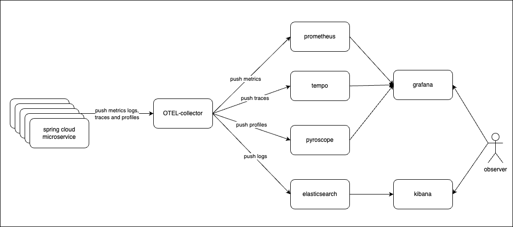

# OpenTelemetry POC



## Create the environment: the lazy mode

```bash
./setup_environment.sh
```

After installation, you can access the following observability consoles:

- Elasticsearch: https://elasticsearch.localhost/
- Kibana: https://kibana.localhost/
- Grafana: https://grafana.localhost/
- Pyroscope: https://pyroscope.localhost
- Prometheus: https://prometheus.localhost
- AlertManager: https://alertmanager.localhost

To monitor the Kind cluster:

```bash
k9s --context kind-kind
```

## Requirement Podman

```bash
podman machine stop
podman machine set --rootful
podman machine rm -f

podman machine init \
  --cpus 4 \
  --memory 8192 \
  --disk-size 50 \
  --rootful

podman machine start
```

## Create the environment: Step-by-Step mode

### Start local docker images registry

```bash
docker run -d -p 5000:5000 --restart=always --name registry registry:2
```

### Cluster creation

- Install requirements

```bash
brew install kind kubectl helm k9s
```

- Create Kind cluster

```bash
kind create cluster --config kind-config.yaml
```

- Install metrics server

```bash
# metrics server installation
kubectl apply -f https://github.com/kubernetes-sigs/metrics-server/releases/latest/download/components.yaml --context kind-kind
# patch to work with Kind
kubectl patch deployment metrics-server -n kube-system --type 'json' -p '[{"op": "add", "path": "/spec/template/spec/containers/0/args/-", "value": "--kubelet-insecure-tls"}]' --context kind-kind
# verify
kubectl get pods -n kube-system | grep metrics-server
```

- Monitor Kind cluster

```bash
k9s --context kind-kind
```

- Install NGINX ingress conttroller

```bash
kubectl apply -f https://raw.githubusercontent.com/kubernetes/ingress-nginx/master/deploy/static/provider/kind/deploy.yaml --context kind-kind
```

### Component Installation

#### Install CertManager:

- [CertManager](https://artifacthub.io/packages/helm/cert-manager/cert-manager)

```bash
# add the official repo
helm repo add jetstack https://charts.jetstack.io
helm repo update
# Install cert-manager
helm upgrade --install cert-manager jetstack/cert-manager \
  --namespace cert-manager \
  --create-namespace \
  --version v1.16.2 \
  -f values-certmanager.yaml \
  --kube-context kind-kind
```

Create a self-signed ClusterIssuer

```bash
kubectl apply -f cluster-issuer.yaml --context kind-kind
```

#### Install ElasticSearch & Kibana (Logs aggregation & visualization):

- [ElasticSearch](https://artifacthub.io/packages/helm/elastic/elasticsearch)
- [Kibana](https://artifacthub.io/packages/helm/elastic/kibana)

```bash
# add the official repo
helm repo add elastic https://helm.elastic.co
helm repo update
# Install elasticsearch
helm upgrade --install elasticsearch elastic/elasticsearch \
  --namespace logging \
  --create-namespace \
  --version 7.17.3 \
  --values values-elasticsearch.yaml \
  --kube-context kind-kind

# Install Kibana
helm upgrade --install kibana elastic/kibana \
  --namespace logging \
  --create-namespace \
  --version 7.17.3 \
  --values values-kibana.yaml \
  --kube-context kind-kind
```

Configure index patterns

```bash
# Composable index template
curl -X PUT "http://elasticsearch.localhost/_index_template/fluentbit-logs-template" \
-H "Content-Type: application/json" \
-d '{
  "index_patterns": ["fluentbit-*"],
  "template": {
    "mappings": {
      "dynamic": true,
      "properties": {
        "@timestamp": {
          "type": "date"
        },
        "log": {
          "type": "text"
        },
        "service": {
          "type": "keyword"
        }
        // Add other fields based on your log structure
      }
    }
  },
  "composed_of": [],
  "priority": 100,
  "data_stream": {}
}'
```

#### Install Fluentd (Logs collector agent):

- [Fluentd](https://artifacthub.io/packages/helm/fluent/fluentd)

```bash
# add the official repo
helm repo add fluent https://fluent.github.io/helm-charts
helm repo update
# InstallFluentd
helm upgrade --install fluentd fluent/fluentd \
  --namespace logging \
  --create-namespace \
  --version 0.5.2 \
  --values values-fluentd.yaml \
  --kube-context kind-kind
```

#### Install Tempo & Pyroscope (Tracing & Continous profiling):

- [Tempo](https://artifacthub.io/packages/helm/grafana/tempo)
- [Pyroscope](https://artifacthub.io/packages/helm/grafana/pyroscope)

```bash
# add the official repo
helm repo add grafana https://grafana.github.io/helm-charts
helm repo update
# install tempo
helm upgrade --install tempo grafana/tempo \
  --namespace observability \
  --create-namespace \
  --version 1.16.0 \
  --values values-tempo.yaml \
  --kube-context kind-kind
# install pyroscope
helm upgrade --install pyroscope grafana/pyroscope \
  --namespace observability \
  --create-namespace \
  --version 1.10.0 \
  --values values-pyroscope.yaml \
  --kube-context kind-kind
```

#### Install Prometheus, Alertmanager & Grafana (Metrics storage, alerting & visualization)

- [Prometheus Stack](https://artifacthub.io/packages/helm/prometheus-community/kube-prometheus-stack)

```bash
# add the official repo
helm repo add prometheus-community https://prometheus-community.github.io/helm-charts
helm repo update
# Install Promehteus
helm upgrade --install prometheus-stack prometheus-community/kube-prometheus-stack \
  --namespace monitoring \
  --create-namespace \
  --version 67.4.0 \
  --values values-prometheus.yaml \
  --kube-context kind-kind
```

#### Install Opentelemetry Operator

- [OpenTelemetry Operattor](https://artifacthub.io/packages/helm/opentelemetry-helm/opentelemetry-operator)

```bash
# add the official repo
helm repo add open-telemetry https://open-telemetry.github.io/opentelemetry-helm-charts
helm repo update
# Install OpenTelemetry Operator
helm upgrade --install opentelemetry open-telemetry/opentelemetry-operator \
  --namespace observability \
  --create-namespace \
  --version 0.75.1 \
  --values values-opentelemetry.yaml \
  --kube-context kind-kind
```

Create OpenTelemetry Collector:

```bash
kubectl apply -f otel-collector.yaml --context kind-kind
```

## Deploy example test services

```bash
cd spring-petclinic-microservices/
git submodule update --remote --recursive
./mvnw -s .mvn/settings.xml clean install -P buildDocker
export REPOSITORY_PREFIX=localhost:5001
export VERSION=3.2.7
export PODMAN_OPTS="--tls-verify=false"
./scripts/retag-and-push-images.sh
./scripts/pushImages.sh
```

```bash
git remote add petclinicfork https://github.com/adomenech73/spring-petclinic-microservices
git push petclinicfork otel-poc
```

## Clean-up

```bash
kind delete cluster
```

## Submodule Maintenance Guide

### Overview

This repository uses a submodule (`spring-petclinic-microservices`) that contains a forked version of the Spring Petclinic microservices with custom OpenTelemetry instrumentation on the otel-poc branch.

### Maintenance Script

#### Purpose

The `update_petclinic_submodule.sh` script automates the process of:

1. Keeping your feature branch synchronized with upstream changes
2. Rebasing your custom changes onto the latest upstream code
3. Updating the main repository reference
4. Maintaining a clean commit history

#### Usage

```bash
# Make the script executable
chmod +x update_petclinic_submodule.sh

# Run the maintenance script
./update_petclinic_submodule.sh
```

#### What the script does:

1. **Safety Checks:** Ensures no uncommitted changes exist in either repository
2. **Synchronization:** Fetches latest changes from both upstream and your fork
3. **Rebasing:** Applies your changes on top of the latest upstream code
4. **Conflict Handling:** Provides guidance if manual conflict resolution is needed
5. **Reference Update:** Updates the main repository to point to the new submodule commit

#### Prerequisites

- The submodule must be initialized: `git submodule update --init --recursive`
- Your fork remote must be configured as `petclinicfork`
- The upstream remote must be configured as `origin`

#### Best Practices

1. **Run regularly:** Execute this script weekly to stay synchronized with upstream
2. **Test after update:** Always run tests after rebasing: `./mvnw clean install -P buildDocker`
3. **Resolve conflicts promptly:** Address merge conflicts immediately when they occur
4. **Backup first:** Consider branching your main repository before running the script

#### Manual Steps (if script fails)

If the script encounters conflicts:

```bash
cd spring-petclinic-microservices
# Resolve conflicts manually, then:
git add <resolved-files>
git rebase --continue
git push petclinicfork otel-poc --force-with-lease
cd ..
git add spring-petclinic-microservices
git commit -m "Update submodule after conflict resolution"
git push origin main
```

This script ensures your OpenTelemetry instrumentation remains compatible with upstream changes while maintaining a clean development history.
